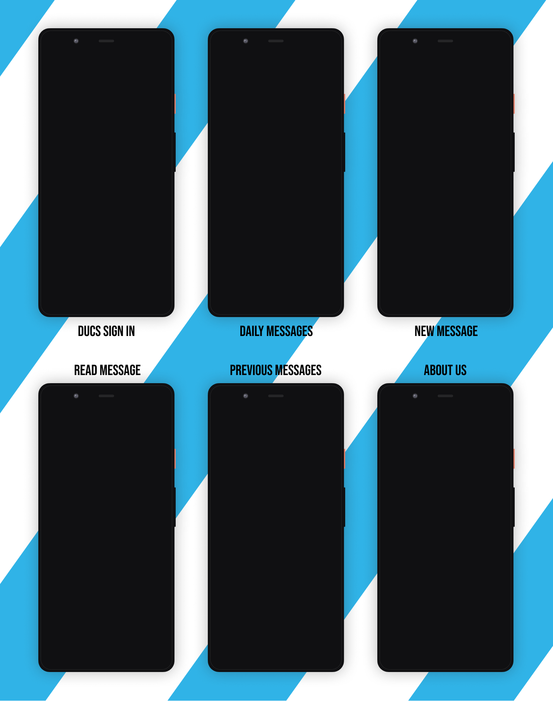

# Android-Study-Jams

Thought Board DUCS

<b> Problem Statement: </b>

In Department of Computer Science, University of Delhi, students from MCA and MSC Computer Science, work together on multiple occasions and colaboration on these events need a large number of students to be brought at one place for sharing their thoughts. This process leads to the creation of numerous Whatsapp groups every year. These groups in-turn remains as a part of students chat history and can't be accessed by the students of the next academic year (if they want to access ideas/resources). Also, there is a limit of 256 members on the number of participants in a whatsapp group hindering a proper communication between seniors & juniors, and not every students agrees to make an account on some other services like Signal, Telegram, etc. This overall scenario creates a feeling of detachment among the students.

<b> Proposed Solution : </b>

This project proposes an Open-Chat Android Application for intradepartmental communications for Department of Computer Science, University of Delhi. In this application, 
 - the users can only login with DUCS domain email id (ending with @cs.du.ac.in), discarding the need of account creations, since every student gets a departmentally issued email id on admission
 - the sign in flow uses google's one tap for better authentication experience
 - the messages are displayed date wise and messages of ex-students will also be available for new students of further academic sessions
 - there is no limit on the number of users (active at a time), since only the currently working students will have access to the application.
 - the messages are grouped by dates for a better access to specific event related messages/resources.
 - the user can reply on any message(post) though the email reply button on the message screen
 - the author of the message can delete his/her messages while he/she is an active students of the department (or they can contact the admin for message deletion)

    	  	
<b> Functionality & Concepts used : </b>

- The App has a very simple and interactive interface which allows the students to send and read messages (with a title) authenticated by their Departmental Domain Emails. Following are few android concepts used to achieve the functionalities in app : 
- Constraint and Linear Layout : Most of the activities in the app uses a flexible constraint layout, which is easy to handle for different screen sizes. Some activities also use a linear layout for better presentation.
- Simple & Easy Views Design : Use of familiar audience EditText with hints and interactive buttons made it easier for students to sign in and send messages without providing any detailed instructions pages. Apps also uses App Navigation to switch between different screens.
- RecyclerView : To present the list of messages, we used the efficient recyclerview.
- Room Database : The user signup details, including, username and email are saved using Room Database. Also we are planning to save favourite messages locally in Room Database, in the future releases.
- Firebase Realtime DB : For serving data to the application and provide a better performance and offline caching. We are using the Spark Plan of firebase with 1Gb storage and 10Gb data transfer that is planned to be upgraded in future depending on the usage & audience's response on the applications.
- LiveData : We are also using LiveData to update & observe any changes in the Date Picker and Messages(Posts) Array from firebase realtime database.
- Viewmodel : We have implemented a Viewmodel setup for handing the data and api requests for the the NewMessage screen.

<b> Application Link & Future Scope : </b>

The app is currently in the Alpha testing phase with 2021-22 batch students of Department of Computer Science, University of Delhi, You can access the app here : [APP LINK HERE]().

Once the app is fully tested during the Sankalan'21 event (the annual departmental fest event), we plan to make it the primary mode of communication and resource sharing with the addition of features like:
 - support for sharing docs and links
 - grouping messages by themes/hashtags/events
 - feature for saving favourite messages locally or on cloud
 - external sharing of messages on social media and other chatting applications
